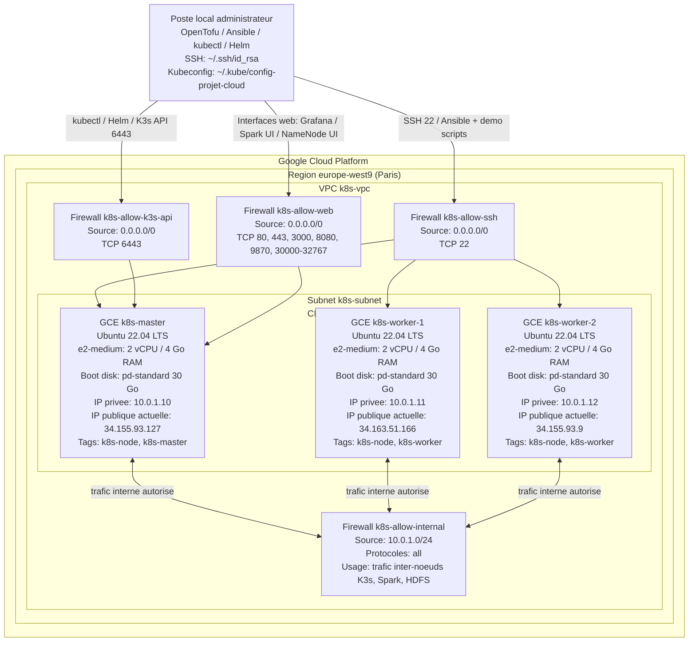
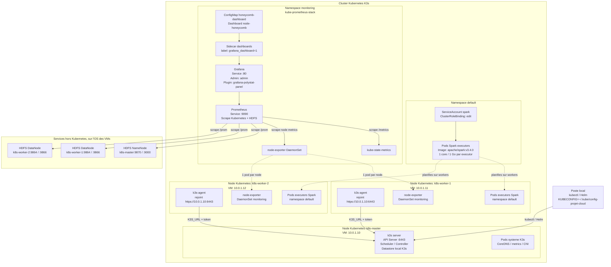
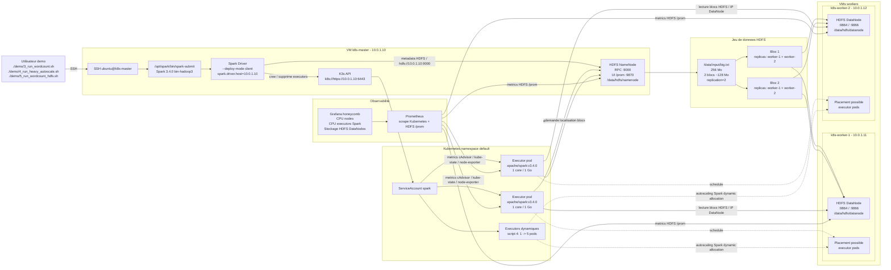

# SSOT (Single Source of Truth) - Projet Cloud & Big Data

Ce document sert de **Source Unique de Vérité (SSOT)** pour tous les collaborateurs et agents autonomes intervenant sur ce projet. Il définit l'architecture technique, la répartition des rôles entre les outils de déploiement, et le workflow d'exploitation globale.

---

## 🧭 Philosophie & Répartition des Rôles

Pour garantir un déploiement 100% automatisé, propre et reproductible, l'infrastructure est segmentée selon une philosophie claire : **Séparation stricte entre le Contenant et le Contenu**.

```
┌────────────────────────────────────────────────────────┐
│               1. LE CONTENANT (OpenTofu)               │
│  - Création du réseau VPC & Sous-réseau                │
│  - Règles de pare-feu (sécurité interne & externe)     │
│  - Provisionnement des VMs Compute Engine (GCE)        │
│  - Attribution des adresses IP fixes et clés SSH       │
└──────────────────────────┬─────────────────────────────┘
                           │
                           ▼ Génère l'inventaire dynamique
┌────────────────────────────────────────────────────────┐
│               2. LE CONTENU (Ansible)                  │
│  - Configuration de l'OS (mises à jour, dépendances)   │
│  - Installation et configuration de K3s Master/Agent   │
│  - Sécurisation locale & couplage réseau               │
│  - Exportation de la configuration Kubernetes          │
└──────────────────────────┬─────────────────────────────┘
                           │
                           ▼ Prêt pour les charges de travail
┌────────────────────────────────────────────────────────┐
│             3. L'APPLICATION (Kubernetes)              │
│  - Orchestration via Helm ou manifestes YAML           │
│  - Déploiement de Prometheus & Grafana (Monitoring)    │
│  - Déploiement de Hadoop Spark (Mode Cluster)          │
│  - Exécution du WordCount                              │
└────────────────────────────────────────────────────────┘
```

### 1. OpenTofu (ou Terraform) : Le Contenant 📦
* **Rôle** : Créer l'infrastructure réseau et physique dans Google Cloud Platform.
* **Philosophie** : OpenTofu déclare *où* et *sur quoi* s'exécute notre projet. Si l'on souhaite ajouter de la mémoire, un nouveau nœud worker, ou modifier une règle de pare-feu cloud, c'est ici que cela se passe.
* **Livrables clés** : 
  - Un VPC isolé et sécurisé (`k8s-vpc`).
  - Trois machines virtuelles GCE (1 Master, 2 Workers) avec clés SSH associées.
  - Un fichier d'inventaire `/ansible/inventory.ini` **généré automatiquement** à chaque exécution de manière dynamique.

### 2. Ansible : Le Contenu ⚙️
* **Rôle** : Configurer les machines et installer la suite logicielle Kubernetes (K3s).
* **Philosophie** : Ansible déclare *l'état exact requis* à l'intérieur de nos machines. Si une machine redémarre ou est recréée, Ansible peut être réappliqué instantanément pour la remettre dans son état nominal sans tout reconstruire.
* **Livrables clés** :
  - Un cluster Kubernetes (K3s) pleinement opérationnel avec 1 nœud Master et 2 nœuds Workers connectés.
  - La récupération du fichier de configuration sécurisé `kubeconfig` copié sur la machine de l'administrateur local pour le contrôle à distance via `kubectl`.

---

## Diagrammes d'Architecture

### 1. Architecture matérielle GCP

Ce diagramme décrit le socle physique réel : projet GCP, zone, VPC, sous-réseau, règles firewall et machines GCE.



Points clés :

- OpenTofu crée le contenant GCP : VPC, subnet, firewall, VMs et inventaire Ansible.
- Les IPs privées sont stables et servent de contrat interne : master `10.0.1.10`, workers `10.0.1.11` et `10.0.1.12`.
- Les IPs publiques sont utilisées pour l'administration SSH et l'accès externe, mais le trafic inter-services passe par le réseau privé `10.0.1.0/24`.
- Les trois VMs sont des `e2-medium` avec 30 Go de disque standard. HDFS utilise le disque boot via `/data/hdfs/...`, sans disque additionnel.

### 2. Architecture Kubernetes K3s

Ce diagramme décrit la couche orchestrateur : K3s server, agents, namespaces, monitoring et pods Spark.



Points clés :

- Le control-plane K3s est sur `k8s-master`. Les workers rejoignent le cluster via `https://10.0.1.10:6443` avec le token défini dans `ansible/group_vars/all.yml`.
- Le kubeconfig est récupéré par Ansible et adapté pour l'administration externe depuis la machine locale.
- Spark n'est pas installé comme un service permanent Kubernetes : les jobs créent des pods executors à la demande dans le namespace `default`.
- Prometheus/Grafana sont déployés dans `monitoring` via Helm. Le dashboard honeycomb est provisionné par ConfigMap, pas créé manuellement dans l'UI Grafana.
- HDFS tourne hors Kubernetes, directement sur les VMs via systemd, mais Prometheus le scrape via les IPs privées des noeuds.

### 3. Architecture Spark + HDFS

Ce diagramme décrit l'exécution applicative : `spark-submit` sur le master, driver en mode client, executors Kubernetes, lecture HDFS distribuée et visualisation.



Points clés :

- Le driver Spark tourne sur la VM master, pas dans un pod, car les scripts utilisent `--deploy-mode client`.
- Les executors sont des pods Kubernetes éphémères créés par Spark via l'API K3s avec le ServiceAccount `spark`.
- `demo/3_run_wordcount.sh` lance un WordCount léger avec 2 executors fixes.
- `demo/4_run_heavy_autoscale.sh` lance SparkPi avec dynamic allocation : Spark augmente le nombre d'executors jusqu'à `MAX_EXEC=5`, puis scale down après inactivité.
- `demo/5_run_wordcount_hdfs.sh` lance un WordCount sur `hdfs://10.0.1.10:9000/data/input/big.txt`.
- HDFS est distribué sur les deux workers : NameNode sur master, DataNodes sur workers, réplication `2`, deux blocs visibles sur les deux DataNodes.
- Le client HDFS est déjà disponible dans Spark 3.4.0 `bin-hadoop3`, donc aucune image custom n'est nécessaire.
- Le NameNode renvoie des IPs de DataNodes, pas des hostnames, via `dfs.client.use.datanode.hostname=false`; cela permet aux pods executors de joindre directement `10.0.1.11` et `10.0.1.12`.

---

## 📁 Structure du Répertoire IaC

```
projet_cloud/
├── terraform/                # Gestion du Contenant (OpenTofu)
│   ├── providers.tf          # Déclaration du provider GCP
│   ├── variables.tf          # Définition des variables éditables
│   ├── terraform.tfvars      # Paramètres appliqués (ex: project_id, ssh_key)
│   ├── network.tf            # Création VPC, sous-réseau et Pare-feu
│   ├── compute.tf            # Définition des instances virtuelles GCE
│   └── outputs.tf            # Sorties utiles et génération automatique d'inventory.ini
│
├── ansible/                  # Gestion du Contenu (Ansible)
│   ├── group_vars/
│   │   └── all.yml           # Configuration globale (Token K3s, User GCP, etc.)
│   ├── inventory.ini         # Généré automatiquement par OpenTofu
│   ├── ansible.cfg           # Réglages de connexion SSH d'Ansible
│   └── playbooks/
│       ├── site.yml          # Playbook racine (point d'entrée)
│       ├── common.yml        # Tâches communes aux 3 instances (mise à jour, utilitaires)
│       ├── master.yml        # Déploiement et démarrage de K3s Master
│       ├── worker.yml        # Déploiement et jonction des agents Workers
│       ├── spark.yml         # Installation Spark, image executors, RBAC Kubernetes
│       └── hdfs.yml          # Déploiement HDFS natif (NameNode + DataNodes)
│
├── k8s/                      # Déploiement applicatif (Kubernetes)
│   ├── prometheus/           # Helm values, dashboards Grafana, scrape HDFS
│   └── spark/                # Documentation et ressources Spark éventuelles
│
├── demo/                     # Scripts de démonstration orale
│   ├── 3_run_wordcount.sh    # WordCount Spark léger, 2 executors fixes
│   ├── 4_run_heavy_autoscale.sh # SparkPi lourd, dynamic allocation 1 -> 5
│   └── 5_run_wordcount_hdfs.sh  # WordCount Spark lisant un fichier HDFS
│
├── var.md                    # Déclaration de l'ID projet (PROJET_ID)
├── projetmodia.md            # Spécifications de l'UE d'origine
└── SSOT.md                   # Ce document
```

---

## 🛠️ Workflow de Déploiement (Étape par Étape)

### Prérequis Locaux
1. Avoir **OpenTofu** ou **Terraform** installé sur sa machine.
2. Avoir **Ansible** installé (`brew install ansible` sur macOS).
3. Être authentifié sur GCP avec l'outil gcloud : `gcloud auth application-default login`.
4. Disposer d'une clé SSH publique locale dans `~/.ssh/id_rsa.pub`.

### Étape 1 : Provisionnement de l'infrastructure (OpenTofu)
Se placer dans le dossier Terraform, initialiser le projet et appliquer la configuration :
```bash
cd terraform
tofu init
tofu apply
```
*Cette étape crée le réseau, les VMs et écrit dynamiquement le fichier `../ansible/inventory.ini`.*

### Étape 2 : Configuration du cluster Kubernetes (Ansible)
Se placer dans le dossier Ansible et exécuter le playbook d'automatisation :
```bash
cd ../ansible
ansible-playbook -i inventory.ini playbooks/site.yml
```
*Cette étape installe K3s, connecte les nœuds, et rapatrie la configuration Kubernetes (`kubeconfig`) dans `~/.kube/config-projet-cloud`.*

### Étape 3 : Administration du cluster
Vous pouvez désormais interagir avec votre cluster Kubernetes GCP directement depuis votre terminal local :
```bash
export KUBECONFIG=~/.kube/config-projet-cloud
kubectl get nodes
```

---

## 🛑 Nettoyage (Destruction des ressources)
Pour détruire toutes les ressources GCP et éviter de consommer inutilement des crédits GCP hors ligne :
```bash
cd terraform
tofu destroy
```
