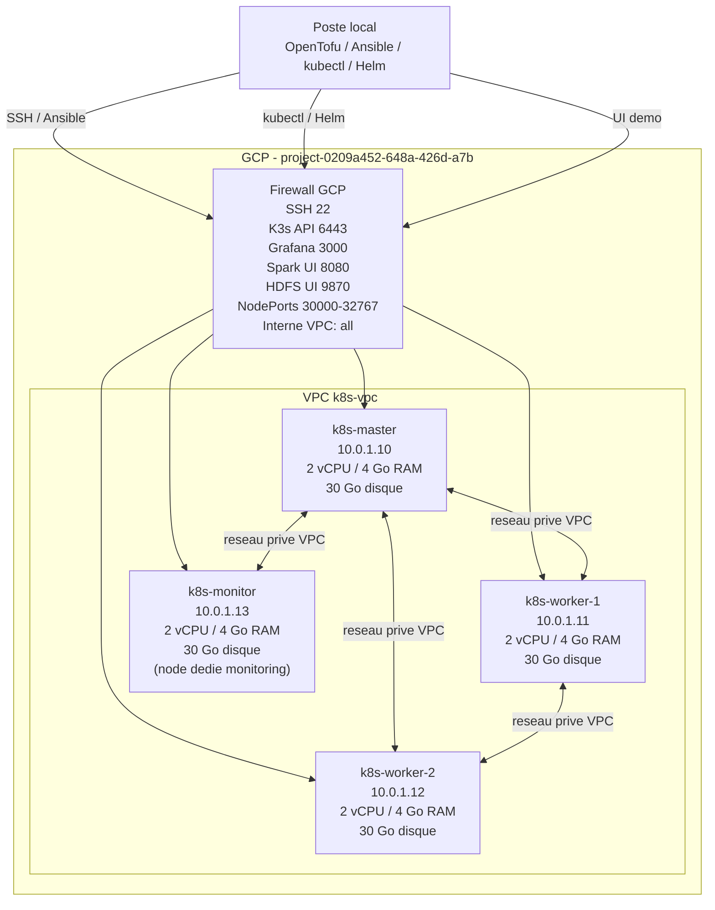
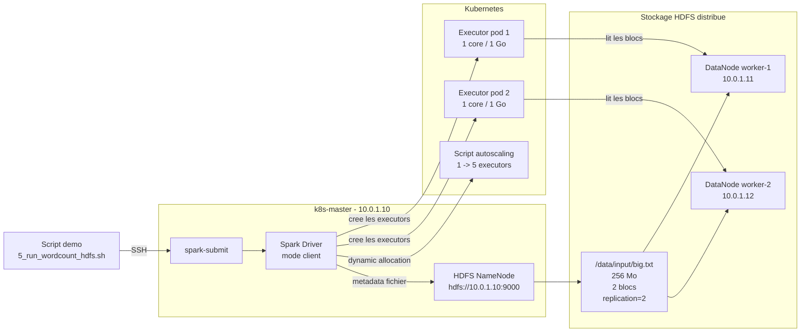

# Diagrammes de demo - Architecture projet cloud

Ce fichier contient des diagrammes Mermaid simplifiés pour expliquer l'architecture pendant la démonstration orale.

## 1. Architecture matérielle GCP



Lecture du diagramme :

- OpenTofu crée le VPC, le subnet, les firewalls et les 4 VMs.
- 3 VMs de calcul (master + 2 workers) + 1 VM dédiée au monitoring (`k8s-monitor`).
- Les machines ont des IPs internes fixes dans `10.0.1.0/24`.
- Les communications entre machines passent par le réseau privé GCP.
- Les accès externes servent seulement à administrer et montrer les interfaces.

## 2. Architecture Kubernetes K3s

```mermaid
flowchart TB
  Admin["Poste local\nkubectl / Helm"]

  subgraph K3S["Cluster Kubernetes K3s"]
    Master["k8s-master\nK3s server\nAPI :6443"]
    Worker1["k8s-worker-1\nK3s agent"]
    Worker2["k8s-worker-2\nK3s agent"]

    subgraph Default["namespace default (sur master + workers)"]
      SA["ServiceAccount spark"]
      Exec["Pods executors Spark\nephemeres"]
    end

    MonNode["k8s-monitor\nK3s agent\nnode DEDIE\nlabel role=monitoring\ntaint dedicated=monitoring:NoSchedule"]
    subgraph Monitoring["namespace monitoring (epingle sur k8s-monitor)"]
      Prom["Prometheus"]
      Graf["Grafana"]
      Dash["Dashboard honeycomb\nConfigMap"]
    end
  end

  subgraph VMServices["Services systemd sur les VMs\nhors Kubernetes"]
    NN["NameNode HDFS\nmaster :9000 / :9870"]
    DN1["DataNode HDFS\nworker-1 :9864 / :9866"]
    DN2["DataNode HDFS\nworker-2 :9864 / :9866"]
  end

  Admin -->|kubectl / Helm| Master
  Worker1 -->|join K3s| Master
  Worker2 -->|join K3s| Master
  MonNode -->|join K3s| Master

  SA --> Exec
  Exec -.->|jamais sur k8s-monitor\n(taint)| Worker1
  Exec -.-> Worker2

  Monitoring -->|nodeSelector + toleration| MonNode

  Dash --> Graf
  Graf --> Prom
  Prom -->|metrics Kubernetes| Master
  Prom -->|metrics Kubernetes| Worker1
  Prom -->|metrics Kubernetes| Worker2
  Prom -->|metrics HDFS /prom| NN
  Prom -->|metrics HDFS /prom| DN1
  Prom -->|metrics HDFS /prom| DN2
```

Lecture du diagramme :

- K3s orchestre les pods Kubernetes.
- Spark crée ses executors comme pods temporaires dans Kubernetes (master + workers).
- Le node `k8s-monitor` est dédié : labellisé `role=monitoring` et tainté `NoSchedule`, donc seuls les pods monitoring y atterrissent (pas d'executors Spark).
- Toute la stack monitoring (Prometheus, Grafana, Alertmanager...) est épinglée dessus via `nodeSelector` + `toleration` → les nodes de calcul restent déchargés.
- HDFS ne tourne pas en pods : il tourne directement sur les VMs via systemd.
- Prometheus observe à la fois Kubernetes et HDFS (endpoint natif `/prom`).
- Grafana affiche les dashboards, dont le honeycomb CPU/Spark/HDFS.

## 3. Architecture Spark + HDFS



Lecture du diagramme :

- Le driver Spark tourne sur le master, car les scripts utilisent `--deploy-mode client`.
- Les executors sont des pods Kubernetes.
- Le fichier d'entrée est dans HDFS, pas dans l'image Docker Spark.
- Le NameNode indique où sont les blocs, puis les executors lisent directement les DataNodes.
- La réplication `2` place chaque bloc sur les deux DataNodes.
